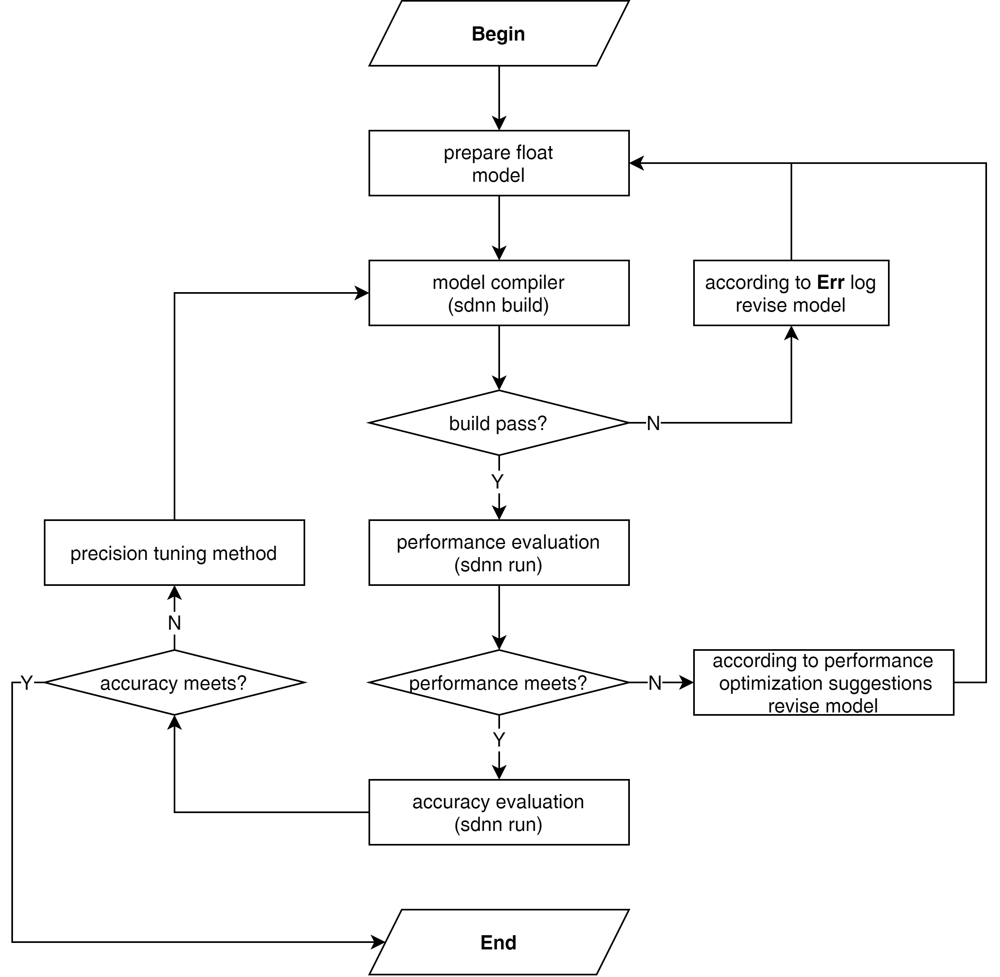

========
快速入门
========

----
概述
----

本章节介绍了模型编译和部署的总体流程，具体开发步骤可以参考下图实施。

硬件准备
========

#. 9系列SOC开发板
#. **USB** 数据线
#. 电脑

首先通过拨码开关配置为下载模式，然后通过 ``SDToolBox`` 软件给开发板下载系统镜像包。

软件准备
========

参考 :ref:`develop_prepare` 章节搭建sdnn开发环境，镜像容器中默认未安装sdnn工具集，需要手动安装工具包。

.. note::

   目前只提供docker开发环境，请确保电脑安装docker软件服务。

--------------
编译第一个模型
--------------

概述
====

本节从 `sdnn_model_zoo` 中的 **mobilenet_v2** 模型出发，详细介绍模型编译和部署流程。

性能调优阶段
============

模型编译
--------

直接通过如下命令可以快速评估模型是否可以编译：

.. code-block:: bash

   $ sdnn build mobilenet_v2.onnx -a slimai

上述指令如果未通过，请查看出错的log信息，如果是某些算子不支持请参考算子支持列表的算子限制条件对模型作相应的调整。

模型性能评估
------------

然后通过如下命令直接评估模型的性能：

.. code-block:: bash

   $ sdnn run -a slimai --profile /dump/models/x86_64_linux_slimai_mobilenetv2_7.tar

分析模型推理性能是否可以满足实际部署需求，如果满足要求可以进入下一阶段，如果不满足，则需要分析模型每层性能指标，找出模型的性能瓶颈，然后参考 **性能优化建议** 章节内容，对模型的相关算子或结构作相应调整。

精度调优阶段
============

sdnn配置文件准备
----------------

在模型初次编译成功后，会在编译的当前目录下生成 ``xxx.sdnn.cfg`` 文件，可以基于该文件修改，并增加 **Dataset** 字段信息，详细内容请参考 :ref:`build_sdnn_cfg_file` 章节内容。

模型编译
--------

编译时添加 :ref:`build_cfg` 选项，用于配置模型量化相关参数，详细操作指令如下：

.. code-block:: bash

   $ sdnn build mobilenet_v2.onnx -a slimai -c mobilenetv2_7.sdnn.cfg

准备推理数据
------------

模型精度的评估需要使用真实的数据作为模型推理的输入，请参考 :ref:`run_inputs` 对原始图做相应的处理，并生成 ``npz`` 格式文件。

模型精度评估
------------

通过添加 :ref:`run_inputs` 选项去配置模型推理输入的图片数据，并使用 TopK 方法评估分类模型的精度，详细执行命令如下：

.. code-block:: bash

   $ sdnn run -i img_data.npz -a slimai --print-top 5 /dump/models/x86_64_linux_slimai_mobilenetv2_7.tar

如果模型的精度满足应用要求，可以在开发板上执行模型部署。 如果精度始终不满足要求，请参考 :ref:`slimai_tune` 章节内容，尝试使用不同的精度调优方法。

模型部署阶段
============

首先参考 :ref:`develop_board` 章节内容，部署好相关依赖库文件，然后通过 ``scp`` 或 ``adb`` 工具拷贝 ``x86_64_linux_slimai_mobilenetv2_7.tar`` 文件到开发板上并解压压缩包，最后使用 ``sdnn_run`` 工具对模型进行快速评估。

性能评估
--------

评估性能执行如下命令：

.. code-block:: bash

   $ ./sdnn_run deploy.json --print-time

性能报告格式如下：

.. code-block:: bash

   Execution time summary: 135.232 [fps]
   mean (ms)       median (ms)     max (ms)        min (ms)        std (ms)
    7.395           7.338           7.878           7.319           0.026

精度评估
--------

精度评估执行如下指令：

.. code-block:: bash

   $ ./sdnn_run deploy.json -i=cat.png

分类模型的精度报告如下：

.. code-block:: bash

   |------------------------------|
   |            Top5              |
   |           0.00 %
   |------------------------------|
   | Index | Score |     Label    |
   |-------|-------|--------------|
   |  282  | 9.989 | tiger cat
   |  287  | 9.161 | lynx, catamount
   |  285  | 9.068 | Egyptian cat
   |  278  | 9.019 | kit fox, Vulpes macrotis
   |  281  | 8.856 | tabby, tabby cat
   |------------------------------|

.. note::

   请参考 :ref:`deploy_json_description` 章节内容，修改deploy.json文件种的 ``metric`` 字段，将方法配置为 **TopK** 。