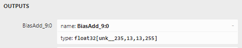
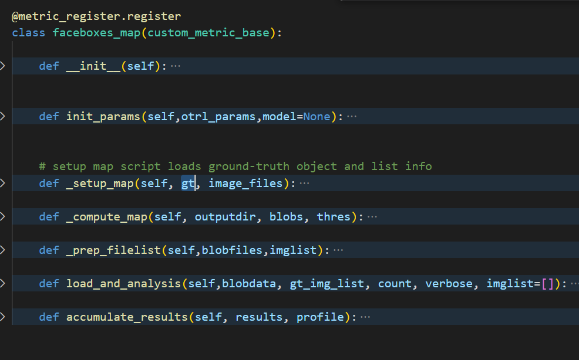

==================
SlimAI模型量化调优
==================

量化前置知识
============

Single Shot Calibration
------------------------

Single Shot Calibration 是基于最小化KL散度或者MSE方差来实现量化参数定标的。在tensor分布和可行的最大最小值分布组成的一个超空间中去逐层最小化选定的度量（例如MSE），最终得到最优量化参数。

- Single Shot Calibration 使能： 配置文件中 ``[quantization]`` 部分增加 ``histogram_bins = #number#`` , 建议设置 ``histogram_bins =10240`` ，设置后 ``range`` 项失效。
- Calibration 方法目前支持两种： ``ImprovedKL`` 和 ``ImprovedMSE`` 。配置文件中[quantization] 下设置 ``calibration = ImprovedKL`` 或 ``calibration =ImprovedMSE`` 进行方法选择。不设置则默认使用ImprovedMSE。

智能搜索
--------

SlimAI模型量化尝试搜索 ``accuracy level`` 和 ``range`` 值（它们的组合后面总称为量化参数）组成的组合空间得到最佳量化模型，可提高量化后模型的准确性，这种方式称为智能搜索。
当 ``accuracy level`` 为逗号分割的多个参数时，智能搜索会自动开启。显式的开启智能搜索则是在配置文件中添加 ``[smart_search]`` 部分。 ``smart_search_level = 1`` 对maskrcnn、unet和deeplab网络有作用，如果网络名称中出现以上网络名字则会触发对应的超参搜索，而其他网络smart_search_level = 0或者1没有差异。添加示例如下：

.. code-block:: shell

   [smart_search]
   smart_search_level = 0
   time_limit = 7200   #搜索最大时长7200秒

.. attention::

   智能搜索由于会暂存大量数据于内存因此需要系统有足够内存资源，否则可用通过减少 ``accuracy level`` 和 ``range`` 的范围来降低内存需求。

量化实施建议
============

模型的量化后性能精度表现与多个因素相关，因此是个逐步优化的过程。客户可以根据工程进展需要逐步调优模型，下面给出一般建议步骤：

1. 在模型的初始集成和验证阶段，推荐首先使用single-shot calibration方法快速量化，仅需要标定集，不依赖验证集，可尝试两种不同的距离度量 ``ImprovedKL`` 和 ``ImprovedMSE``，可初步体验量化结果，开发出初始模型可进行模型集成验证工作。
2. 如果快速方法效果不能满足应用需求，可通过配置 ``[quantization]`` 里的 ``accuracy_level`` 和 ``range`` 进行最优量化参数搜索，建议先固定 ``accuracy_level`` 并设置一个小 ``range`` 范围进行搜索，确认数据集和cfg配置都有效后，扩大 ``accuracy_level`` 和 ``range`` 取值，使用智能搜索获得最佳量化准确度，在此基础上调整 ``accuracy_level`` 和 ``range`` 做最后的性能和准确度的平衡。此类方法需要准备验证集——数据和对应label。
3. 最后在 ``accuracy_level`` 和 ``range`` 都确定后，仍然难于得到较好的性能和效果平衡，则需要进一步实施精调最大最小值以及混精量化。
4. 若用户已有预量化好的模型，可跳过这部分，直接参考 :ref:`prequantized-reference-label` 。

模型量化度量
============

量化调试前置知识
----------------

cfg配置调试与控制
^^^^^^^^^^^^^^^^^
多输出情况下以及需要用户自定义度量的情况下，需要通过设置 ``[metric]`` 下的 ``output_debug`` 项，并运行一次编译得到所需信息。output_debug可配置为0-3，默认为0，即不进行调试输出。

.. list-table:: output_debug取值对应功能
   :header-rows: 1
   :widths: 50 256
   :stub-columns: 1

   *  -  取值
      -  功能说明
   *  -  0
      -  默认状态，调试输出关闭
   *  -  1
      -  输出output_control.octrl及浮点推理参考
   *  -  2
      -  在1的基础上增加定点推理输出和量化profile yaml文件
   *  -  3
      -  在2的基础上增加网络逐层输出和相似度对比信息

当output_debug配置为非0时，调试输出信息会存放于用户定义的输出文件夹中即配置文件的 ``[path]`` 下的 ``output_dir`` 项定义的文件夹。输出的文件一个示例如下：

.. code-block:: shell

   .
   ├── BestProfile.txt
   ├── FixedPoint_Results.txt
   ├── glow_imagenet_224_png_calib.txt
   ├── glow_imagenet_224_png_val.txt
   ├── mobilenet_v2
   ├── mobilenet_v2_96
   ├── mobilenet_v2_96.yaml
   ├── mobilenet_v2_97
   ├── mobilenet_v2_97.yaml
   ├── mobilenet_v2_98
   ├── mobilenet_v2_98.yaml
   ├── mobilenet_v2_99
   ├── mobilenet_v2_99.yaml
   ├── mobilenet_v2_ref
   ├── output_control.octrl
   ├── ProfileList.txt
   ├── similarity.txt
   ├── tmp_imagenet_224_png_calib.txt
   ├── tmp_imagenet_224_png_val.txt
   └── tvmgen_mobilenet_v2_slimai_main_0.onnx

这里着重说明几个文件和文件夹：
1. output_control.octrl 给出SlimAI输出内部名称和次序。如下是其内容的一个示例：

.. code-block:: shell

   [reshape_3800 reshape_40] save

例中[]中就是用空格隔开的两个输出名reshape_3800和reshape_40。在量化度量中以此名字命名的blob会按照此次序作为列表成员被加载。如果需要修改次序来满足度量计算的要求，可以通过设置 ``[metric]`` 下的 ``replace_output`` 项。例如上例中，如果需要调换输出次序可在cfg文件中做如下配置：

.. code-block:: shell

   ...
   [metric]
   replace_output = [reshape_40 reshape_3800]
   metric_cls = xxx
   metric_input = xxx
   ...

2. ``模型名_ref`` 和 ``模型名_数字`` 文件夹，内部存放的文件是量化度量用来计算的中间数据。 ``模型名_ref`` 内是原始浮点模型推理的输出，用于量化调优参考， ``模型名_数字`` 是数字对应的range取值时的量化模型输出，上例中 ``mobilenet_v2_ref`` 为浮点模型输出， ``mobilenet_v2_96`` 到 ``mobilenet_v2_99`` 是量化搜索范围 ``range = 96:99:1`` 时各步量化尝试的输出。
每个文件夹中存放的是所选验证集图像的推理输出文件，其中这些文件的命名规则是 ``图像名_输出名.blob`` 。例如验证集内一个图像 ``ILSVRC2012_val_00000001.png`` 会生成 ``ILSVRC2012_val_00000001_add_30.blob`` 的输出文件（mobilenet_v2网络仅输出一项add_30，如果输出为多项则会生成多个blob文件）。 ``模型名`` 文件夹结构和 ``模型名_ref`` 一致，它是定标集数据的浮点模型推理输出，如上例中 ``mobilenet_v2`` 文件夹。
blob文件是文本格式，可以直接阅读，第一行分别为量化系数（第二行的数值除以它就是反量化的数值），宽，高，通道，batch以及数据类型。下例中反量化系数为1.0（因为是本已是浮点输出），W=5618, H=1 C=15, batch=1 数据类型为float32，第二行为tensor的具体数值，其数据排布固定为NCHW。

.. code-block:: shell

   1.00000000e+00 5618 1 15 1 F32
   0.996356 0.998880 0.997434 0.997196 ...

3. ``模型名_数字.yaml`` 文件，它是数字对应range取值时的网络各层数据分布情况统计， ``similarity.txt`` 是相似度分析信息汇总报告，输出相同节点的量化前后的余弦相似度，下面是一个示例：

.. code-block:: shell

   The similarity of nn_conv2d_760 between fixed and float model is: 0.996759
   The similarity of nn_bias_add_750 between fixed and float model is: 0.999363
   ...

上述余弦相似度的值是此节点在所有验证图片上的均值。 ``BestProfile.txt`` 是记录了最终选择的量化参数profile文件, 下面是一个示例：

.. code-block:: shell

   #cat BestProfile.txt
   mobilenet_v2_92.yaml

.. _dumpdata-reference-label:

blob文件解析
^^^^^^^^^^^^^

- SlimAI中的排布记号从左到右依次是stride由小到大的次序，DWH即NHWC排布， WHD即NCHW。
- 输出在SlimAI内都是被当成DWH（即我们通常意义的NHWC排布，N=1，例如网络输出（1 x 1 x 5618 x 15）那么被解释为N=1, H=1, W=5618, C=15 或者称D=15）。
- 输出结果的dump到blob文件中排布均变为WHD（即我们通常意义的NCHW排布）,例如网络输出（1 x 1 x 5618 x 15）按上面的排布解释，在dump文件中会被存储为NCHW = 1 x 15 x 1 x 5618。可参见上小节的blob文件内容示例。

常见基本度量
------------

检测
^^^^^

voc_det_AP
"""""""""""

使用pascal voc格式数据的检测网络可以使用准确度度量mAP，记为 ``voc_det_AP`` 。它是通过分析不同类别平均检测精度，进行简单算术平均得到的度量值。因此需要检测后处理完成后的输出，输出次序是output_boxes， output_confidences 和output_class_indices。cfg文件中 ``[metric]`` 段配置示例如下：

.. code-block:: shell

   ...
   [metric]
   metric_cls = voc_det_AP
   metric_input = /workspace/det_model/voc_annotation/ center=True,threshold=0.30001
   ...

.. note::
   ``metric_input`` 项等号后面用空格间隔为两项，第一项为图片对应voc格式的标注xml文件所在的文件夹的绝对路径，例如/workspace/det_model/voc_annotation/，第二项为逗号分隔的参数项（注意第二项中不能再有空格出现）

可选的参数项有：

.. list-table:: voc_det_AP的metric_input可选参数
   :header-rows: 1
   :widths: 50 256
   :stub-columns: 1

   *  -  参数
      -  取值说明
   *  -  center
      -  是否是中心坐标格式输出，默认False。需要yfirst配合。
   *  -  yfirst
      -  是否y值在前，默认False。需要center配合。
   *  -  threshold
      -  在进行mAP计算前，对数据进行过滤，仅当confidence大于该阈值时，才确认为有效检测，默认值为0。
   *  -  data_offset
      -  估计值值域与label值域的偏移值，默认为0，具体见下面介绍。
   *  -  scale_width/scale_height
      -  对bbox的宽高进行缩放的因子，默认为1.0。
   *  -  div_width/div_height
      -  对bbox的宽高进行缩小的比例，默认为0.0，不生效；当非零时，其值会用于替换scale_width/scale_height。
   *  -  custom_pp
      -  可取yolo或ssd，下面具体介绍其配置

center和yfirst一起确定模型输出数据的解析方式，当center=True，如果yfirst=False则按 (CX, CY, W, H)格式解析结果，反之则按(CY, CX, H, W)格式解析结果，而center=False时，如果yfirst=False按(XMIN, YMIN, XMAX, YMAX)方式解析数据，否则按照(YMIN, XMIN, YMAX, XMAX)方式进行解析。

data_offset的取值示例：例如Ground-truth第0类非背景类，而检测模型输出第0类却是背景类，则需要将模型输出-1才能与得到与Ground-truth一致的值，那么配置data_offset = -1，该值被加到输出上进行偏移处理，从而使其与Ground-truth匹配。

yolo和ssd两类后处理都需要配置网络输入图像size，此配置项为：

- 网络输入图像大小input_size，格式为input_size=w:h。

custom_pp=ssd或yolo时，支持voc pascal格式自定义类别label的配置：

- voc pascal格式的自定义labels，格式如下：中括号扩起来的label的列表，label使用分号分隔，不能出现空格，例如 voc_labels=[person;bicycle;car;truck;bus;traffic_light]

custom_pp=yolo时，目前支持最多3个尺度的检测featuremap，它有一些特有的配置项：

- nms所需要的iou阈值，格式为iou_threshold=浮点阈值，例如iou_threshold=0.6
- 网络输出的数据layout，格式为layout=排布格式，排布格式仅支持HWC和CHW。举个具体实例，如果onnx网络输出的size形如13x13x255那么设置layout=HWC，

而若形如255x13x13则设置layout=CHW。

- anchor的配置，格式如下：宽高用冒号隔开，宽高对用分号隔开，一个尺度上的宽高对组成一个list，例如yolov3-tiny的anchors=[81:82;135:169;344:319][10:14;23:27;37:58]

一个典型的voc pascal数据类型训练的yolo网络，其量化度量部分配置示例如下：

.. code-block:: shell

   ...
   [metric]
   metric_cls = voc_det_AP
   metric_input = /workspace/yolov2_tiny/imagelist custom_pp=yolo,center=True,data_offset=1,threshold=0.6,iou_threshold=0.3,input_size=416:416,layout=CHW,anchors=[34.56:38.08;109.44:141.12;212.16:364.16;301.44:163.52;531.84:336.64]
   ...

custom_pp=ssd时，仅支持priorbox直接从文件加载方式，不支持网络中算法方式，且bbox输出layout为1xNx4，prob输出layout为1xNxm的网络，N为anchor的总数量，m为检测类别数。priorbox和variance以txt文件形式提供。将生成的priorbox存入anchor.txt文件中，其格式为前若干行存放priorbox生成的anchor，每行分别为xmin，ymin，xmax，ymax，使用空格分隔，后若干行为variance，默认一般为0.1和0.2。下面为简单示例：

.. code-block:: shell

   ...
   350.0 50.0 610.0 310.0
   337.13422 37.134216 622.8658 322.86578
   388.0 -4.5 572.0 364.5
   405.0 -46.0 555.0 406.0
   0.1 0.2
   0.1 0.2
   0.1 0.2
   0.1 0.2
   ...

该文件与ground-truth标注文件放在一起，即若数据格式为voc pascal，那么该文件与xml标注文件同文件夹，而若数据格式为coco，那么该文件与标注汇总json文件同文件夹。网络要求删去priorbox部分的算子，推理时不再做priorbox的计算，而从anchor.txt文件加载。

一个自定义类别的voc pascal格式数据训练的ssd网络的量化度量部分配置示例如下：

.. code-block:: shell

   ...
   [metric]
   metric_cls = voc_det_AP
   metric_input = /workspace/road_det/imagelist/Annotations/ custom_pp=ssd,input_size=640:360,center=True,threshold=0.30001,data_offset=-1,voc_labels=[person;bicycle;car;truck;bus;traffic_light]
   ...

coco_det_AP
"""""""""""

使用coco格式数据的检测网络可以使用准确度度量mAP，记为 ``coco_det_AP`` 。它是通过分析不同类别平均检测精度，进行简单算术平均得到的度量值。因此需要检测后处理完成后的输出，需要检测后处理输出次序是output_boxes， output_confidences ，output_class_indices还可以包括output_instance_mask。配置 ``[metric]`` 段示例如下：

.. code-block:: shell

   ...
   [metric]
   metric_cls = coco_det_AP
   metric_input = /workspace/coco2014/annotations/instances_val2014.json 80 custom_pp=yolo,center=True,data_offset=1,threshold=0.5,iou_threshold=0.6,input_size=416:416,layout=HWC,anchors=[81:82;135:169;344:319][10:14;23:27;37:58]
   ...

.. note::
   ``metric_input`` 项等号后面用空格间隔为三项，第一项为图片coco格式的标注json文件的绝对路径，第二项为非背景总类别数，第三项为逗号分隔的参数项（注意第三项中不能再有空格出现），可选的参数项与 ``voc_det_AP`` 一致。

分割
^^^^^

SegStats
""""""""""
分割网络的准确度度量有"PixelAccuracy","MeanIU","MeanAccuracy","FrequencyWeightedIU" ，记为 ``PxAcc``, ``MIU``, ``MAcc``, ``FrWIU``:

- PixelAccuracy 表示正确分类像素占总像素的比，
- MeanIU 表示每类正确像素与本类像素及误分为本类的像素和之比的简单算术平均
- MeanAccuracy，是PixelAccuracy的升级版，为每类正确像素占比（正确分类和该类总数的比）的简单算术平均
- FrequencyWeightedIU，是MeanIU的强化版，为每类正确分类像素与本类像素及误分为本类的像素和之比的加权算术平均，权重为每类的出现频率。

如果要启用分割度量，需要在配置文件中填入 ``[metric]`` 段，配置度量类型 ``metric_cls = SegStats`` ，这时默认使用MeanIU。如果需要指定其他度量则需要 ``metric_cls = SegStats`` 中的 ``SegStats`` 替换为 ``PxAcc``, ``MAcc``, ``FrWIU`` 中其一。配置 ``[metric]`` 段示例如下：

.. code-block:: shell

   ...
   [metric]
   metric_cls = SegStats
   metric_input = /workspace/segmentation/label.txt axis=1,threshold=0.5
   ...

.. note::
   ``metric_input`` 项等号后面是用空格间隔的两项，第一项为label文件的绝对路径，例如/workspace/segmentation/label.txt，第二项为逗号分隔的参数项（注意第二项中不能再有空格出现），可选的参数项有压缩轴项axis，阈值项threshold，插值方法项（“resizeNN”， "resizeBi"， "resizeCu"）。

- 压缩轴项axis：axis表示对dump的blob数据的压缩的轴，axis 可取 0，1，2 分别对应NCHW中的 C，H，W位置，例如dump的数据排布是NCHW = 1 x 15 x 1 x 5618，如果axis=0 则C=15的维度被压缩，得到1x5618的图像，而如果axis=1 则H=1的维度被压缩，得到15x5618的图像，若axis=2 则W=5618的维度被压缩，得到15x1的图像。如果所选压缩轴尺度已为1，则直接压缩，而如果所选压缩轴尺度不为1则将该维度上最大值的index作为压缩后的像素类别值。关于dump数据的排布解析可参考 :ref:`这里 <dumpdata-reference-label>`

- 阈值项threshold：二分类分隔可使用二值化阈值项，调整它使得生成的数据（默认数据为[0,1]区间）被二值化，大于阈值的数值被赋1，小于等于阈值的赋0，对于Ground-truth会做同样的操作，如果Ground-truth图片是灰度图，会先归一化到[0,1]区间然而根据阈值二值化作为真值参考。当不设置threshold时，则处理多分类分割情况，浮点数据被直接截断为uint8数据，即去除小数部分。

- 插值方法项：压缩转换完的uint8数据可进行尺寸缩放以匹配Ground-truth，可以有三种插值方法可选“resizeNN”， "resizeBi"， "resizeCu"分别对应最近邻，双线性和双三次插值方法，参数格式resizeXX=w:h，宽高用冒号分隔，例如resizeNN=240:288

图像差异度量
^^^^^^^^^^^^
图像超分辨率、图像风格化、图像分割、图像修复等等这类输出为单个非负数填充的tensor（图像）的网络可以使用psnr（还有l1,l2, ssim 这种统计描述像素信号变化）进行网络量化效果的评价。metric_cls可配置为 ``psnr``， ``l1``, ``l2``, ``ssim``。metric_input可配置项有3种，用空格分隔。

- use_float: 使用该项，不需要为validation集提供标注，直接使用浮点模型的输出作为ground-truth。
- ground-truth layout适配输出控制, 可取值['chw', 'whc', 'cwh'， 'hwc'] 指示输出结果的layout，ground-truth将被转置与其一致，例如ground-truth是宽288高240的rgb图像，如果设置chw会被转置为3x240x288, 如果设置whc会被转置为288x240x3。
- range: 度量方法默认输出结果数据范围[0,1]区间,当输出的数据范围不是[0,1]时，而是[0，N]，N 为大于1的正整数（注意此度量方法类不接受负数，负数数据会被强制clip为0）需要设置range=N，表示输出的数值在0-range这个区间，默认不设置则range=1，数据为[0,1]区间的浮点数。

.. code-block:: shell

   ...
   [metric]
   metric_cls = psnr
   metric_input = cwh range=255
   # metric_input = use_float #注释掉上面一行metric_input 去掉此行注释符此时无需准备验证集数据，直接使用浮点输出作为ground-truth
   ...

自定义度量
----------

用户的模型多种多样、模型配套的数据集和度量方法各不相同，因此需要提供一套方法便于用户自定义度量。 目前用户可以将自己编辑的metric类以插件的形式注册到SDNN中，用户在cfg文件中可以指定使用该方法进行度量。在此metric类中包含四大部分自定义的内容：
1. metric输入参数的解析
2. 模型输出的后处理函数
3. 数据标签的解析
4. metric的具体计算
目前已有部分数据标签的解析以及metric的具体计算放在util文件夹中，以类的形式组织，既可用作metric插件实现的示例，也可用于用户自定义metric的基础。
编辑完metric类后用户可以快速独立自测，检查metric类的正确性。正确编写的metric类可通过cfg文件进行指定调用，完成模型的量化调优。

- 自定义metric步骤：

1. 用户在模型cfg文件中定义metric的名字，并以此名命名新的类文件于TVM/python/tvm/sdrv/backend_plugins/slimai_custom_metric/metric_plugin/下。
2. 对1.中定义的metric类进行细节实现。
3. 在cfg中添加output_debug=2选项，运行量化编译模型命令，获取中间结果，对自定义的metric进行调试。
4. 将cfg中的output_debug=2选项去除，运行量化编译模型命令，完成模型编译。

- 自定义metric类的调测

TVM/python/tvm/sdrv/backend_plugins/slimai_custom_metric/metric_test.py可对用户定义好的metric类进行调试和测试。具体需要配置的字段见下注释部分：

.. code-block:: python

   if __name__=='__main__':
      # 请仅修改#符号包括的配置部分来进行自定义metric的开发测试，其他部分不要修改，以保证自定义metric注册可使用
      ##################################################################################################
      metric_obj = faceboxes_map() # 更换为待测试的类
      octrl_file = "/workspace/examples/slimai_cfg/faceboxes/output/output_control.octrl"   #output_debug配置导出的的octrl文件  output_control.octrl
      flt_dump_path = "/workspace/examples/slimai_cfg/faceboxes/output/facebox_ref"
      imagelistfile = "/workspace/examples/slimai_cfg/faceboxes/output/tmp_imagelist_val.txt"   #output_debug配置导出的的valiation imagelist文件
      tmpdir = "/workspace/examples/slimai_cfg/faceboxes/output/"
      outdir = "/workspace/examples/slimai_cfg/faceboxes/output/"
      verbose=False
      network_name = 'faceboxes'  #用来测试的网络名称
      rlower= 92; rupper = 93; stride = 1# 对应 range = 92:93
      count = 3  #希望拿来进行测试的样本数，必须不大于tmp_imagenet_224_png_val.txt提供的样本数量
      ###################################################################################################
      par =(1, 'FixedPoint_Results.txt','Fixed',flt_dump_path)
      QProfile = []
      for idx in range(rlower, rupper+1, stride):
         QProfile.append('{}_{}.yaml'.format(network_name, idx))

      compute_metric(imagelistfile, octrl_file, tmpdir, count, QProfile, par,
                     verbose, metric_obj, outdir)

调试需要用户提供的输入配置主要有octrl_file、flt_dump_path、imagelistfile、tmpdir和outdir，为了获取上述的前三个文件，需要用户在cfg文件中添加output_debug = 2 选项并运行量化编译命令。cfg配置如下：

.. code-block:: shell

   ...
   [metric]
   output_debug = 2
   metric_cls = faceboxes_map
   metric_input = faceboxes/imagelist threshold=0.6
   [quantization]
   accuracy_level = 0
   range = 92:92
   [performance]
   optimization = level2

生成的上述文件会输出到cfg中用户定义的output_dir 文件夹中。

.. note::

   设置out_debug = 2运行编译命令来获取中间结果的时候，建议把range 和accuracy_level 设置为固定值，以产生有限的数据，使调试更有目标

- 自定义metric示例

此处以faceboxes为示例简要说明自定义metric添加和使用的过程。

1. 用户需要在slimai_cfg下对应的cfg文件中的metric选项上添加上自己定义的metric方法。如下：

.. code-block:: shell

   ...
   [metric]
   output_debug = 2
   metric_cls = faceboxes_map
   metric_input = faceboxes/imagelist threshold=0.6

2. 对应用户需要在tvm/python/tvm/sdrv/backend_plugins/slimai_custom_metric/metric_plugin/下添加faceboxes_map.py文件(或置于用户自己定义的其他路径，并将此路径设置为环境变量CUSTOM_METRIC_PATH)并在其中定义faceboxes_map类，且必须继承自custom_metric_base。如下示例：

此类的成员函数中__init__、init_params、load_and_analysis、accumulate_results四个函数为custom_metric_base类定义子类必须要实现的。__init__初始化metric类需要使用的变量。init_params用于解析用户定义cfg里面metric选项配置的参数。load_and_analysis函数为metric类的计算入口。进入load_and_analysis函数，首先调用_prep_filelist。_prep_filelist函数读取blobsfile 和 imglist输出blob文件，blobsfile文件为模型的直接输出。接着调用_compute_map函数，在_compute_map函数中，调用后处理函数(用户自己提供)、调用标签解析函数、调用度量计算实现函数、得到metric结果。

.. attention::

   #. load_and_analysis必须返回metric数值，如果返回多个数值，第一个数值作为比较的依据，数值范围需要归一化到0-1之间，越大的值表示模型量化越好，数值如果不在0-1之间，smart search无法生效。

   #. 用户定义metric类必须import以下两行 python包

   .. code-block:: python

      from file_utils import blob_file_reader
      from metric import metric_register, custom_metric_base

3. 参照上一节“自定义metric类的调测”进行自测。
4. 关掉output_debug = 2 选项，进行最终量化编译。

量化精调
--------

如果网络全局的量化参数控制无法保证量化的效果，需要对量化编译进行更为精细的调整。目前SlimAI已开发了这部分调整功能。

由于量化控制参数选择不当，在某些网络层数据量化后计算精度损失严重，导致网络整体精度下降。那么需要将这样的瓶颈层找出，这时需要对验证数据进行分析，找出问题明显的样本。使用这些样本做验证集，进行逐层相似度的统计分析，找出导致精度下降的关键层。

逐层量化参数精调
^^^^^^^^^^^^^^^^
在cfg文件中的metric选项添加Adjust = True

.. code-block:: shell

   ...
   [metric]
   ...
   Adjust=True
   ...

此时在用户指定的output_dir下会生成Adjust_yaml文件夹，在此文件中会包含一个yaml文件，此文件为编译过程的量化文件。yaml文件上信息如下：

.. code-block:: shell

   ...
   NodeOutputName:  'Add_add_410__1:0'
   Min:             -3.0
   Max:             2.0
   ...

上例中Add为节点类型，add_410为节点的名字，__1:0为编译器添加的后缀名。用户可以找到特定节点并修改其中的Min或者Max的值来达到微调此节点量化效果的目的。修改完成后重新运行量化编译程序。

.. attention::

   用户在生成Adjust_yaml目录前，如果Adjust_yaml文件夹已经存在需要用户手动删除。

混合精度
^^^^^^^^

混合8bit/16bit量化需要按照以下步骤操作：

1. 在cfg文件的quantizatin选项下添加Mix=True选项。以打开混合精度量化的开关并获取到.dot文件。
2. 利用得到的.dot文件，用户编写yaml文件(其中指定混个精度的节点名字或者类型以及数据类型)，在Mix=True选项下添加nodekind_datatype或者nodename_datatype选项，并将yaml文件名字传递过去，并编译量化模型。

在cfg文件中的quantization下添加Mix=True选项，

.. code-block:: shell

   ...
   [quantization]
   ...
   Mix=True
   ...

开启编译，此时在用户指定的output_dir路径下回生成dot_path文件夹，此文件夹下包含的是一些量化过程中的.dot文件，找到其中以_before_requantization.dot结尾的dot文件。用户需要编写一个yaml文件来指出对哪些节点的输入或者输出类型进行何种变化。yaml的编写方式有两种，按照节点名字(nodename_datatypes)指定输入输出类型或者按照节点类型(nodekind_datatypes)指定输入输出类型。下为按照节点名字(nodename_datatypes)指定输入输出类型示例：

.. code-block:: shell

   ---
   - nodes: [Conv__134__4,Conv__220__3]
   intypes: [s8]
   outtypes: [s16]
   - nodes: [Conv__130__*]
   intypes: [s16]
   outtypes: [s16]

此时需要在cfg文件中添加nodename_datatypes选项并传入yaml文件名:

.. code-block:: shell

   ...
   [quantization]
   ...
   Mix=True
   nodename_datatypes = <your_network>.yaml

也可选择按照节点类型指定输入输出类型：

.. code-block:: shell

   ---
   - nodes: [XIConvolution]
   intypes: [s16]
   outtypes: [s16]

这时需要在cfg文件中添加nodekind_datatypes选项并传入yaml文件名：

.. code-block:: shell

   ...
   [quantization]
   ...
   Mix=True
   nodekind_datatypes  = <your_network>.yaml

配置完成重新进行模型的编译。精调直至达到精度预期。

.. note::

   #. 用户编辑的yaml文件的名字需要和cfg的名字一致，比如mobilenet_v2.cfg，则yaml文件命名为mobilenet_v2.yaml。
   #. 用户yaml文件的存放路径和cfg文件同目录。

.. attention::

   #. 此种方式仅仅支持逐通道量化，所以不支持accuracy level 0量化。
   #. 未指定的节点的数据类型保持由accuracy level确定的类型。
   #. 如果nodekind_datatypes和nodename_datatypes都在cfg文件中指定，则以节点名(nodename_datatypes)指定的数据类型优先。
   #. 通配符(*)要慎用，可能会导致不可预见的节点数据类型的强制转换。

.. _prequantized-reference-label:

预量化模型
==========

SlimAI支持Fully Quantized Tflite模型，可以是通过训练框架进行量化感知训练（QAT）得到，或者是训练后量化工具（PTQ）得到。对于Fully Quantized的模型，所有的激活和权重都有预先定好的量化参数，用{scale, offset}表示。 所有的权重值都直接以定点来保存，因此不会触发SDNN的量化过程，直接进入代码生成和编译阶段。

预量化模型必须满足纯8-bit量化，其中权重支持per-tensor和per-channel的量化方式，激活只支持per-tensor量化。由于SlimAI仅支持对称量化的权重，因此非对称的per-tensor量化的权重会被转换成对称量化的权重。而对于激活，可以通过 ``accuracy_level=3`` 来配置采用非对称量化（0-2会使用对称量化）。accuracy_level范围只能取0-3。

目前支持的算子有限，tflite预量化模型SlimAI支持的算子见附录。

.. note::
   预量化模型的编译配置cfg文件中 ``model_type`` 需要设置为 ``model_type = quantized``。另外，虽然它不会经历量化阶段，但是cfg文件中 ``[dataset]`` 段仍要设置，仅用于满足格式检查，无实际作用。