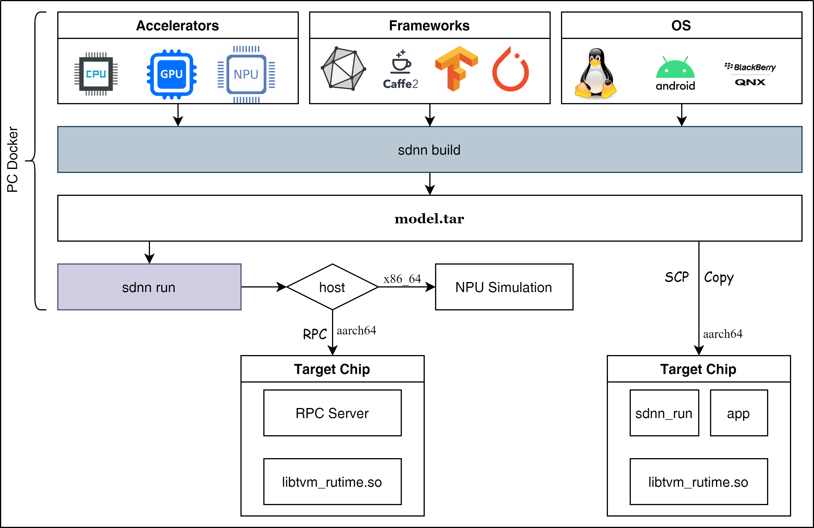
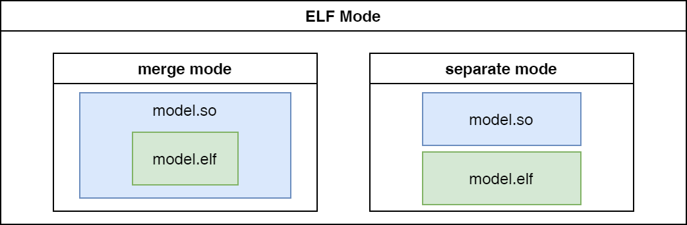
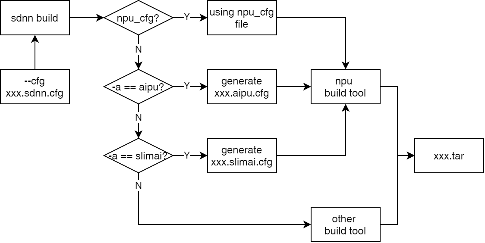

==============
SDNN工具集介绍
==============

----
概述
----

``sdnn`` 是实现模型 **编译** 和 **推理** 的工具集合，其中 :ref:`sdnn_build` 工具可以将不同框架的模型文件通过编译工具链转换成SDNN格式文件，即输出 ``tar`` 格式的压缩包，里面包含模型部署所需的文件。 :ref:`sdnn_run` 工具可以直接在开发机端加载编译生成的文件，进行模型推理。该工具有两种方式，一种是通过NPU仿真器模拟模型的推理，另一种是通过与芯片端建立RPC通讯机制，实现模型在芯片端的推理。如果需要在开发板端直接跑模型推理，可以将模型编译的tar包文件拷贝到开发板端，使用预编译的 :ref:`sdnn_run_tool` 可执行程序推理模型。

.. note::

   #. 目前版本RPC功能还不支持

--------
使用步骤
--------

工具获取
========

请通过 `客户支持系统 <https://support.semidrive.com/account/login>`_ 获取最新的SDNN编译工具包。

工具安装
========

执行下述命令安装SDNN工具：

.. code-block:: shell
   :linenos:

   $ pip install sdnn_cl-{sdnn版本号}-{python版本号}-{主机平台}.whl

.. note::

   请在 :ref:`sdnn_dev_container` 中安装sdnn工具集，而非开发机本地环境；

模型编译
========

关注性能
--------

如果不关注模型的精度，只关注模型的性能，可以在编译NPU设备过程中不指定sdnn配置文件。此时sdnn工具会自动生成一个可用的配置文件，并使用随机数生成模型量化所需的校验数据，此方式只影响模型量化的精度，对性能评估无影响。详细执行命令如下：

.. code-block:: shell

   $ sdnn build -a {加速设备} xxx.onnx

关注精度
--------

如果需要评估模型的精度，则sdnn配置文件是必需提供的。该配置文件中的 **Dataset** 字段需要设置模型实际用到的校验或验证图片集，并保证图片数量在100张左右，请参考 :ref:`build_sdnn_cfg_file` 进行相关配置。详细执行命令如下：

.. code-block:: shell

   $ sdnn build -a {加速设备} -c xxx.sdnn.cfg xxx.onnx

模型推理
========

性能评估
--------

如果只评估性能，可以不配置 ``--inputs -i`` 选项，此时sdnn工具默认会使用随机数作为模型的推理输入。如果需要获取模型的详细性能信息，还需要添加 ``--profile`` 选项。详细执行命令如下：

.. code-block:: shell

   $ sdnn run -a {加速设备} --profile dump/models/{主机平台}_{操作系统}_{加速设备}_{模型名}.tar

精度评估
--------

如果需要评估模型的精度，则需要使用真实图片数据作为模型推理的输入，此时需要对图片进行相关前处理，并保存为npz格式文件，关于文件的准备请参考 :ref:`run_inputs` 章节内容。然后通过 ``--inputs -i`` 选项进行设置。对于分类模型，sdnn工具提供了 **TopK** 后处理函数，例如，可以通过配置 ``--print-top 5`` 获得分类模型的Top5推理结果。 详细执行命令如下：

.. code-block:: shell

   $ sdnn run -a {加速设备} -i xxx.npz --print-top 5 dump/models/{主机平台}_{操作系统}_{加速设备}_{模型名}.tar

如果不是分类领域的模型，目前没有提供相关的后处理函数，需要配置 ``--outputs -o`` 选项，转存模型推理输出数据为 ``npz`` 格式文件，后续可以通过python脚本加载该文件并实现模型后处理方法来评估模型精度。详细执行命令如下：

.. code-block:: shell

   $ sdnn run -a {加速设备} -i xxx.npz -o xxx.npz dump/models/{主机平台}_{操作系统}_{加速设备}_{模型名}.tar

-------------
sdnn 参数说明
-------------

Optional parameter
==================

.. table:: SDNN基础选项
   :name: sdnn_base_params

   +------------------+------------+--------------------+
   | 命令参数         | 需求状态   | 说明               |
   +==================+============+====================+
   | :ref:`sdnn_help` | *optional* | sdnn工具帮助信息   |
   +------------------+------------+--------------------+
   | :ref:`version`   | *optional* | 获取sdnn工具版本号 |
   +------------------+------------+--------------------+
   | :ref:`debug`     | *optional* | 使能sdnn工具调试   |
   +------------------+------------+--------------------+

.. _sdnn_help:

``--help -h``
-------------

帮助选项可以查看工具的详细使用说明，当遇到 ``sdnn`` 工具的使用问题时，建议添加 :ref:`sdnn_help` 选项来获取帮助信息。

.. _version:

``--version -v``
----------------

版本选项可以查看工具的详细版本信息，输出信息如下：

.. code-block:: shell

   $ sdnn -v
   SDNN Version: v3.0.0

.. _debug:

``--debug -d``
--------------

调试选项可以全局打开调试信息输出。

Required parameter
==================

.. table:: SDNN必要选项
   :name: command_params

   +-------------------+------------+------------------+
   | 命令参数          | 需求状态   | 说明             |
   +===================+============+==================+
   | :ref:`sdnn_build` | *required* | 使能模型编译工具 |
   +-------------------+------------+------------------+
   | :ref:`sdnn_run`   | *required* | 使能模型推理工具 |
   +-------------------+------------+------------------+

.. _sdnn_build:

-----
build
-----

编译阶段所要用到的配置选项可以归纳为以下几类：

#. :ref:`path_params`: 包含编译模型必须配置的选项，即模型文件路径；
#. :ref:`base_params`：包含编译模型常用的编译选项；
#. :ref:`slimai_params`：包含只对SlimAI设备编译有效的特定选项；

Required parameter
==================

.. table:: build必要选项
   :name: path_params

   +-------------------+------------+------------------+
   | 命令参数          | 需求状态   | 说明             |
   +===================+============+==================+
   | :ref:`model_path` | *required* | 设置模型文件路径 |
   +-------------------+------------+------------------+

.. _model_path:

:guilabel:`PATH`
----------------

模型文件路径选项在编译阶段是必要的，当模型文件包含多个文件(caffe)时，则通过 ``:`` 分割两个文件。
如下给出该选项的使用示例：

.. tabs::

   .. tab:: **单** 文件模型

      .. code-block:: bash

         $ sdnn build mobilenet_v2.onnx

   .. tab:: **多** 文件模型

      .. code-block:: bash

         $ sdnn build mobilenet_v1.prototxt:mobilenet_v1.caffemodel

      .. note::

         - 多个文件的配置顺序 ``无`` 限制；

Optional parameter
==================

基础参数
--------

.. table:: build基础选项
   :name: base_params

   +--------------------------+------------+-------------+------------------------------------------+----------------------+
   | 命令参数                 | 需求状态   | 默认值      | 可选范围                                 | 说明                 |
   +==========================+============+=============+==========================================+======================+
   | :ref:`build_help`        | *optional* |             |                                          | build 帮助信息       |
   +--------------------------+------------+-------------+------------------------------------------+----------------------+
   | :ref:`build_cfg`         | *required* |             |                                          | 配置文件路径         |
   +--------------------------+------------+-------------+------------------------------------------+----------------------+
   | :ref:`build_host`        | *required* | **x86_64**  | [``x86_64``, ``aarch64``]                | 主机平台             |
   +--------------------------+------------+-------------+------------------------------------------+----------------------+
   | :ref:`build_os`          | *required* | **linux**   | [``linux``, ``android``, ``qnx``]        | 操作系统             |
   +--------------------------+------------+-------------+------------------------------------------+----------------------+
   | :ref:`build_accelerator` | *required* | **cpu**     | [``cpu``, ``gpu``, ``slimai``, ``aipu``] | 推理加速器           |
   +--------------------------+------------+-------------+------------------------------------------+----------------------+
   | :ref:`build_name`        | *optional* | **default** |                                          | 模型别名             |
   +--------------------------+------------+-------------+------------------------------------------+----------------------+
   | :ref:`build_shape`       | *optional* |             |                                          | 模型输入节点形状     |
   +--------------------------+------------+-------------+------------------------------------------+----------------------+
   | :ref:`build_opt_level`   | *optional* | **3**       | [``1``, ``2``, ``3``, ``4``]             | IR优化等级           |
   +--------------------------+------------+-------------+------------------------------------------+----------------------+
   | :ref:`build_dump_path`   | *optional* | **dump**    |                                          | 编译中间信息转存路径 |
   +--------------------------+------------+-------------+------------------------------------------+----------------------+

.. _build_help:

``--help -h``
*************

帮助选项可以查看工具的详细使用说明，当遇到 ``sdnn build`` 工具的使用问题时，建议添加 :ref:`build_help` 选项来获取帮助信息。

.. _build_cfg:

``--cfg -c``
************

设置模型编译所需的配置文件路径，该选项对于NPU设备编译是必要的，因编译工具需从配置文件中获取额外的量化调优信息。关于配置文件的详细内容参考章节 :ref:`build_sdnn_cfg_file` 。

.. _build_host:

``--host``
**********

配置模型部署平台的主机类型。

.. note::

   #. **x86_64**：指所有 **x86-64** 架构的CPU芯片(intel, AMD);
   #. **aarch64**：指所有 **ARMV8** 架构的CPU芯片(X9, V9);

.. _build_os:

``--operating-system -os``
**************************

配置模型所要部署的操作系统，从而控制sdnn工具编译生成与操作系统相关的格式文件。

.. _build_accelerator:

``--accelerator -a``
********************

配置模型实际要部署的加速设备。

.. _build_name:

``--name -n``
*************

设置输出文件的别名，如果不配置该选项会使用模型原文件的名字作为输出文件的别名。

.. note::

   #. 别名中不要包含 ``-`` 等字符；
   #. 如果模型文件名中包含 ``-`` 字符，且没有指定模型别名，则会自动将模型名中的 ``-`` 字符转成 ``_`` 字符。

.. _build_shape:

``--input-shapes -sp``
**********************

配置模型输入节点的详细参数，包括模型输入名和对应的形状，配置格式如下：

.. code-block:: bash
   :linenos:

   sdnn build --input-shapes "input1:[dim1,dim2,dim3] input2:[dim1,dim2,dim3,dim4]" xxx.onnx

.. note::

   目前大部分模型的输入节点信息都可以自动获取到，无需配置。但当自动获取的信息错误或输入形状是不确定状态时，需要通过该参数手动指定。

.. _build_opt_level:

``--opt-level``
***************

配置对模型IR的优化程度，其数值越大代表优化程度越高。

.. note::

   大部分情况下无需配置，当出现优化后的算子不支持时，可以适当调低等级；

.. _build_dump_path:

``--dump-path``
***************

配置模型编译期间需转存文件的保存路径，其目录下结构如下：

.. code-block:: bash
   :linenos:

   |-- dump
   |   |-- aipu
   |   |-- log
   |   |-- models
   |   `-- slimai

- ``aipu``： **aipu** 设备编译输出的中间IR信息文件目录；
- ``slimai``: **slimai** 设备编译输出的onnx模型文件目录；
- ``models``: 模型编译输出的SDNN格式部署文件目录；
- ``log``: 模型编译生成的log文件目录；

SlimAI参数
----------

.. note::

   下述参数只对 ``slimai`` 设备编译有效。

.. table:: SlimAI参数
   :name: slimai_params

   +---------------------------+------------+--------------+--------------------------------------------+-----------------+
   | 命令参数                  | 需求状态   | 默认值       | 可选范围                                   | 说明            |
   +===========================+============+==============+============================================+=================+
   | :ref:`build_elf_off`      | *optional* | **False**    |                                            | 失效elf文件产生 |
   +---------------------------+------------+--------------+--------------------------------------------+-----------------+
   | :ref:`build_elf_mode`     | *optional* | **separate** | [``merge``, ``separate``]                  | 模型合并模式    |
   +---------------------------+------------+--------------+--------------------------------------------+-----------------+
   | :ref:`build_model_status` | *optional* | **single**   | [``first``, ``mid``, ``last``, ``single``] | 模型编译状态    |
   +---------------------------+------------+--------------+--------------------------------------------+-----------------+

.. _build_elf_off:

``--elf-build-off -b``
**********************

配置是否使能关闭 **elf文件** 生成，即控制是否对模型进行编译优化并生成新的elf文件，该过程一般耗时较大，所以考虑在某些情况下关闭该过程，提升模型编译调试的效率。
一般使用场景是当模型第一次编译已经生成 **elf文件** 后，如果想生成其它 ``os`` 的sdnn部署文件，此时关闭生成elf文件可以减少编译时间。

.. _build_elf_mode:

``--elf-mode -m``
*****************

配置 **elf文件** 与 **so文件** 的组合模式，两种模式的区别如下图所示：

.. tabs::

   .. tab:: separate

      模型编译时默认采用 **separate** 模式，模型的 **so** 文件与 **elf** 文件独立生成。 其中，**elf** 文件包含模型所有的量化参数，**so** 文件只要包含对应模型的网络结构。模型部署时，需要手动拷贝 **elf** 文件到开发板指定目录下：

      - **linux** ： ``/lib/firmware``
      - **android** ： ``/vendor/firmware``
      - **qnx** : 任意目录，但要使用脚本 ``qnx_slimai_deploy.sh`` 加载模型的elf文件。

      .. note::

         #. 如果是多模型编译，建议采用 **separate** 模式, 最终会生成多个模型对应的 **so** 文件和单个 **elf** 文件。
         #. 对于qnx系统部署、多进程开发和Android系统APK代码开发等建议使用 **separate** 模式；

   .. tab:: merge

      单模型编译时可采取 **merge** 模式，该模式下，将模型的 **elf** 文件集成进模型的 **so** 文件中，最终编译只输出单个 **so** 文件。

      .. note::

         #. 该模式的存在主要方便测试，最终产品部署，建议采用 **separate** 模式。
         

.. _build_model_status:

``--model-status -ms``
**********************
      
模型状态信息选项配置当前模型在所有多模型中所处的状态，其默认值为 **single** 。
 
.. tabs::

   .. tab:: 单模型编译

      由于模型状态信息选项的默认值为 **single** ，所以当slimai设备只部署一个模型时，可以不添加该编译参数。

      .. code-block:: bash
         :linenos:

         sdnn build -a slimai --host aarch64 model.onnx

   .. tab:: 多模型编译

      如果需要在slimai设备上同时部署多个模型，则需要通过该配置项指定模型状态。如下图所示，描述了 ``n`` 个模型编译时，每个模型编译对应的状态。

      .. image:: ../_static/images/devp/sdnn_build-multi-model.png

      由上图可知，多模型中第一个要编译的模型对应状态 ``first``，最后一个要编译的模型对应状态 ``last`` ，其它中间的模型对应状态 ``mid`` 。

      1. 多个模型中的第一个模型
      
      .. code-block:: bash
         :linenos:

         sdnn build -a slimai --host aarch64 -ms first model_1.onnx

      2. 多个模型中的中间一系列模型

      .. code-block:: bash
         :linenos:

         sdnn build -a slimai --host aarch64 -ms mid model_2.onnx
                  ...
         sdnn build -a slimai --host aarch64 -ms mid model_(n-1).onnx

      3. 多个模型中的最后一个模型

      .. code-block:: bash
         :linenos:

         sdnn build -a slimai --host aarch64 -ms last model_n.onnx

.. _build_sdnn_cfg_file:

sdnn 配置文件说明
=================

SDNN配置文件的完整参数示例如下：

.. code-block:: bash
   :linenos:

   [Model]
   name = mobilenet_v1
   format = caffe 
   type = float32
   domain = classification

   [Input]
   name = data
   shape = [1, 3, 224, 224]
   dtype = float32
   # [NCHW, NHWC]
   layout = NCHW
   # [RGB, BGR]
   channel_order = RGB
   mean = [103.939, 116.778999, 123.68]
   std = [57.375, 57.12, 58.395]

   [Output]
   name = xxx
   method = transpose
   # supprt output layout: [NCHW, NHWC]
   params = NCHW

   [Dataset]
   name = ImageNet
   path = path/to/data

   [Metric]
   name = TopK
   params = 5

   [Optimizer]
   # setup the path of npu configure file
   npu_cfg = path/to/npu_cfg_file
   # supprt quant bit: [8bit, 16bit]
   quant_bits = 8bit 
   # whether enable winograd optimizer
   winograd = false

Model
-----

模型字段配置模型的本身的信息参数。

+-------------------------+------------+--------------------+-------------------------------------------------------+--------------------+
| 参数名                  | 需求状态   | 默认值             | 可选范围                                              | 参数说明           |
+=========================+============+====================+=======================================================+====================+
| :ref:`cfg_model_name`   | *optional* |                    |                                                       | 模型编译使用的别名 |
+-------------------------+------------+--------------------+-------------------------------------------------------+--------------------+
| :ref:`cfg_model_format` | *optional* |                    | [``caffe``, ``onnx``, ``tf``, ``tflite``]             | 模型所属框架格式   |
+-------------------------+------------+--------------------+-------------------------------------------------------+--------------------+
| :ref:`cfg_model_type`   | *optional* | **float32**        | [``float32``, ``float16``, ``uint8``]                 | 模型权重的数据类型 |
+-------------------------+------------+--------------------+-------------------------------------------------------+--------------------+
| :ref:`cfg_model_domain` | *optional* | **classification** | [``classification``, ``segmentation``, ``detection``] | 模型所属领域       |
+-------------------------+------------+--------------------+-------------------------------------------------------+--------------------+

.. _cfg_model_name:

:guilabel:`name`
****************

设置模型编译使用的别名，如果不配置则采用模型文件名作为编译输出文件的别名。

.. _cfg_model_format:

:guilabel:`format`
******************

设置模型所属训练框架的文件格式。

.. _cfg_model_type:

:guilabel:`type`
****************

设置模型权重数据的数据类型，如果模型的权重数据都是浮点数据类型，则使用[``float32``, ``float16``]表示该类模型。如果模型权重数据已经量化为定点数，并包含量化系数等信息，此类模型称为预量化模型，使用 ``uint8`` 表示该类模型。

.. _cfg_model_domain:

:guilabel:`domain`
******************

设置模型功能所属的领域,该参数会针对模型所属领域做特定优化。

Input
-----

输入字段配置模型输入信息和预处理相关操作。

+--------------------------------+------------+--------+---------------------------------------+------------------+
| 参数名                         | 需求状态   | 默认值 | 可选范围                              | 参数说明         |
+================================+============+========+=======================================+==================+
| :ref:`cfg_input_name`          | *optional* |        |                                       | 模型输入节点名   |
+--------------------------------+------------+--------+---------------------------------------+------------------+
| :ref:`cfg_input_shape`         | *optional* |        |                                       | 模型输入节点形状 |
+--------------------------------+------------+--------+---------------------------------------+------------------+
| :ref:`cfg_input_dtype`         | *optional* |        | [``float32``, ``float16``, ``uint8``] | 模型输入数据类型 |
+--------------------------------+------------+--------+---------------------------------------+------------------+
| :ref:`cfg_input_layout`        | *optional* |        | [``NCHW``, ``NHWC``]                  | 模型输入数据排布 |
+--------------------------------+------------+--------+---------------------------------------+------------------+
| :ref:`cfg_input_channel_order` | *required* |        | [``RGB``, ``BGR``]                    | 模型输入通道顺序 |
+--------------------------------+------------+--------+---------------------------------------+------------------+
| :ref:`cfg_input_mean`          | *optional* |        |                                       | 模型数据集平均值 |
+--------------------------------+------------+--------+---------------------------------------+------------------+
| :ref:`cfg_input_std`           | *optional* |        |                                       | 模型数据集方差   |
+--------------------------------+------------+--------+---------------------------------------+------------------+

.. _cfg_input_name:

:guilabel:`name`
****************

配置模型输入节点的名称，当模型有多个输入时，名称之间采用 ``,`` 分隔，示例如下：

.. code-block:: bash
   :linenos:

   name = name1, name2, name3

.. _cfg_input_shape:

:guilabel:`shape`
*****************

配置模型输入节点的数据形状，当模型有多个输入时，数据形状之间采用 ``,`` 分隔，其顺序要与 ``name`` 字段的顺序匹配，当实际模型的输入名与形状的关系为 ``name1:[1, 3, 224, 224], name2:[1, 3, 320], name3:[1280, 2]`` 时，示例格式如下：

.. code-block:: bash
   :linenos:

   shape = [1, 3, 224, 224], [1, 3, 320], [1280, 2]

.. _cfg_input_dtype:

:guilabel:`dtype`
*****************

配置模型输入节点的数据类型，当模型有多个输入时，数据类型之间采用 ``,`` 分隔，其顺序要与 ``name`` 字段的顺序匹配，当实际模型的输入名与形状的关系为 ``name1:float32, name2:float16, name3:uint8`` 时，示例格式如下：

.. code-block:: bash
   :linenos:

   shape = float32, float16, uint8

.. _cfg_input_layout:

:guilabel:`layout`
******************

配置模型输入的数据排布格式。

.. _cfg_input_channel_order:

:guilabel:`channel_order`
*************************

配置模型输入的数据的通道顺序。

.. _cfg_input_mean:

:guilabel:`mean`
****************

配置训练模型所用数据集的平均值。

.. _cfg_input_std:

:guilabel:`std`
***************

配置训练模型所用数据集的方差。

Output
------

输出字段用于配置增加某些模型后处理节点，用于减少带宽等。

+--------------------------+------------+--------+---------------------+------------------+
| 参数名                   | 需求状态   | 默认值 | 可选范围            | 参数说明         |
+==========================+============+========+=====================+==================+
| :ref:`cfg_output_name`   | *optional* |        |                     | 模型输入节点命名 |
+--------------------------+------------+--------+---------------------+------------------+
| :ref:`cfg_output_method` | *optional* |        | [transpose, argmax] | 模型输入节点命名 |
+--------------------------+------------+--------+---------------------+------------------+
| :ref:`cfg_output_params` | *optional* |        |                     | 模型输入节点命名 |
+--------------------------+------------+--------+---------------------+------------------+

.. _cfg_output_name:

:guilabel:`name`
****************

配置模型输出节点的名称，当模型包含多个输出时，名称之间采用 ``,`` 分隔，示例如下：

.. code-block:: bash
   :linenos:

   name = name1, name2, name3

.. _cfg_output_method:

:guilabel:`method`
******************

配置模型输出节点对应的后处理方法。

.. _cfg_output_params:

:guilabel:`params`
******************

配置模型输出节点对应的后处理参数。

Dataset
-------

数据集字段用于配置模型量化所需的数据集处理。

+-------------------------+------------+--------+------------+------------+
| 参数名                  | 需求状态   | 默认值 | 可选范围   | 参数说明   |
+=========================+============+========+============+============+
| :ref:`cfg_dataset_name` | *optional* |        | [ImageNet] | 数据集名称 |
+-------------------------+------------+--------+------------+------------+
| :ref:`cfg_dataset_path` | *optional* |        |            | 数据集路径 |
+-------------------------+------------+--------+------------+------------+

.. _cfg_dataset_name:

:guilabel:`name`
****************

配置数据集名称。

.. _cfg_dataset_path:

:guilabel:`path`
****************

配置数据集路径。

Metric
------

+--------------------------+------------+--------+----------+--------------+
| 参数名                   | 需求状态   | 默认值 | 可选范围 | 参数说明     |
+==========================+============+========+==========+==============+
| :ref:`cfg_metric_name`   | *optional* |        | [TopK]   | 模型度量方法 |
+--------------------------+------------+--------+----------+--------------+
| :ref:`cfg_metric_params` | *optional* |        |          | 模型度量参数 |
+--------------------------+------------+--------+----------+--------------+

.. _cfg_metric_name:

:guilabel:`name`
****************

配置模型度量的方法。

.. _cfg_metric_params:

:guilabel:`params`
******************

配置模型度量的方法参数值。

Optimizer
---------

优化字段配置模型量化相关参数。

+---------------------------------+------------+--------+---------------+------------------+
| 参数名                          | 需求状态   | 默认值 | 可选范围      | 参数说明         |
+=================================+============+========+===============+==================+
| :ref:`cfg_optimizer_npu_cfg`    | *optional* |        |               | 模型输入节点命名 |
+---------------------------------+------------+--------+---------------+------------------+
| :ref:`cfg_optimizer_quant_bits` | *required* |        | [8bit, 16bit] | 模型输入节点命名 |
+---------------------------------+------------+--------+---------------+------------------+
| :ref:`cfg_optimizer_winograd`   | *optional* | false  | [false, true] | 模型输入节点命名 |
+---------------------------------+------------+--------+---------------+------------------+

.. _cfg_optimizer_npu_cfg:

:guilabel:`npu_cfg`
*******************

设置NPU特定格式的文件路径，当配置文件中包含该选项时，编译器会直接使用指定的npu配置文件。如果不包含该字段，则会基于当前的sdnn配置文件，生成相应的npu配置文件，各个配置文件的关系如下：

.. _cfg_optimizer_quant_bits:

:guilabel:`quant_bits`
**********************

配置NPU的量化位宽。

.. _cfg_optimizer_winograd:

:guilabel:`winograd`
********************

配置是否使能winograd加速，目前只有 ``aipu`` 支持该功能。

.. _sdnn_run:

---
run
---

Required parameter
==================

.. table:: run必要选项
   :name: run_path_params

   +-----------------------+------------+----------------------------+
   | 命令参数              | 需求状态   | 说明                       |
   +=======================+============+============================+
   | :ref:`run_model_path` | *required* | 设置推理模型的编译文件路径 |
   +-----------------------+------------+----------------------------+

.. _run_model_path:

:guilabel:`PATH`
----------------

模型推理加载路径选项在运行阶段是必要的，默认会在 ``dump/models`` 目录生成与模型相关的 ``tar`` 压缩包文件。如果在编译阶段用户设置了自定义的 ``--dump-path`` 目录，则会在用户自定义的目录生成模型编译的文件。

Optional parameter
==================

.. table:: run可选配置项
   :name: run_params

   +------------------------+------------+------------+------------------------------------------+--------------------------+
   | 命令参数               | 需求状态   | 默认值     | 可选范围                                 | 说明                     |
   +========================+============+============+==========================================+==========================+
   | :ref:`run_help`        | *optional* |            |                                          | run 帮助信息             |
   +------------------------+------------+------------+------------------------------------------+--------------------------+
   | :ref:`run_accelerator` | *required* | **cpu**    | [``cpu``, ``gpu``, ``slimai``, ``aipu``] | 推理加速器               |
   +------------------------+------------+------------+------------------------------------------+--------------------------+
   | :ref:`run_profile`     | *optional* |            |                                          | 使能模型分析功能         |
   +------------------------+------------+------------+------------------------------------------+--------------------------+
   | :ref:`run_frequency`   | *optional* | **1000**   |                                          | 设置npu工作频率          |
   +------------------------+------------+------------+------------------------------------------+--------------------------+
   | :ref:`run_fill_mode`   | *optional* | **random** | [``zeros``, ``ones``, ``random``]        | 输入数据的填充模式       |
   +------------------------+------------+------------+------------------------------------------+--------------------------+
   | :ref:`run_inputs`      | *optional* |            |                                          | 加载输入数据的文件路径   |
   +------------------------+------------+------------+------------------------------------------+--------------------------+
   | :ref:`run_outputs`     | *optional* |            |                                          | 保存输出数据的文件路径   |
   +------------------------+------------+------------+------------------------------------------+--------------------------+
   | :ref:`run_print_top`   | *optional* |            |                                          | 使能TopK后处理           |
   +------------------------+------------+------------+------------------------------------------+--------------------------+
   | :ref:`run_print_time`  | *optional* |            |                                          | 使能模型性能评估         |
   +------------------------+------------+------------+------------------------------------------+--------------------------+
   | :ref:`run_end_to_end`  | *optional* |            |                                          | 使能模型端到端的性能评估 |
   +------------------------+------------+------------+------------------------------------------+--------------------------+
   | :ref:`run_repeat`      | *optional* | **1**      |                                          | 模型评估的重复次数       |
   +------------------------+------------+------------+------------------------------------------+--------------------------+
   | :ref:`run_number`      | *optional* | **1**      |                                          | 模型评估的数量           |
   +------------------------+------------+------------+------------------------------------------+--------------------------+
   | :ref:`run_dump_path`   | *optional* | **dump**   |                                          | 编译中间信息转存路径     |
   +------------------------+------------+------------+------------------------------------------+--------------------------+

.. _run_help:

``--help -h``
-------------

帮助选项可以查看工具的详细使用说明，当遇到 ``sdnn run`` 工具的使用问题时，建议添加 :ref:`run_help` 选项来获取帮助信息。

.. _run_accelerator:

``--accelerator -a``
--------------------

配置实际推理的加速设备类型。

.. _run_profile:

``--profile``
-------------

配置是否使能模型每层属性等信息的文档生成。

.. _run_frequency:

``--frequency``
---------------

配置模型在aipu设备上的推理的频率。

.. _run_fill_mode:

``--fill-mode``
---------------

配置模型输入数据的自动填充模式。

.. _run_inputs:

``--inputs -i``
---------------
   
配置模型加载预处理数据文件的路径，如果是原始图片需要通过python工具进行预处理操作，并保存为 ``npz`` 格式文件。假设某分类模型，其模型输入节点参数为 ``data:[1,3,224,224]`` ，原始图片为 ``cat.png`` ，则可以通过如下脚本可转换为需要的格式文件( **npz** )：

.. code-block:: python
   :linenos:

   import numpy as np
   from PIL import Image

   input_shape = [224, 224]
   mean = [123.0, 117.0, 104.0]
   var = [58.395, 57.12, 57.375]

   image = Image.open("cat.png").resize(input_shape)
   image = np.array(image, dtype="float32")
   image = (image - mean) / var
   image = np.expand_dims(image, axis=0)
   image = np.transpose(image, [0, 3, 1, 2])
   np.savez("img_data.npz", data = image)

上述代码中，通过 ``Image`` 模块对png格式图片解码，获取原始图片的数据，再经过一系列前处理算法，将图片数据转化成模型需要的格式，最后，使用numpy的 ``savez`` 方法将内存中处理好的数据保存为 ``npz`` 格式文件。其中，``savez`` 函数的 **key** 值必须是模型的输入节点名称, **value** 值是处理好的图像数据数组。

.. _run_outputs:

``--outputs -o``
----------------

配置模型推理结果数据的保存路径，文件格式也是 ``npz``，需要通过python脚本加载做相关模型后处理算法，评估模型精度。

.. _run_print_top:

``--print-top``
---------------

配置是否使能TopK后处理功能。

.. _run_print_time:

``--print-time``
----------------

配置是否使能模型推理时间评估。

.. _run_end_to_end:

``--end-to-end``
----------------

配置是否使能模型数据传输的性能考量，可以获得更真实的性能数据。必须 ``--print-time`` 使能，该参数才有效。

.. _run_repeat:

``--repeat``
------------

配置模型推理性能评估的循环数，必须 ``--print-time`` 使能，该参数才有效。

.. _run_number:

``--number``
------------

配置每一个循环内的模型推理次数，必须 ``--print-time`` 使能，该参数才有效。

.. _run_dump_path:

``--dump-path``
---------------

配置模型编译阶段指定的dump目录。

.. _sdnn_run_tool:

--------
sdnn_run
--------

概述
====

``sdnn_run`` 是一个通用的模型推理程序，运行在开发板端，包含如下主要功能：

#. SlimAI设备自检；
#. 模型性能评估；
#. 模型精度评估(分类)；

sdnn_run获取
============

请通过 `客户支持系统 <https://support.semidrive.com/account/login>`_ 获取不同平台的 ``sdnn_run`` 工具。

sdnn_run参数说明
================

Required parameter
------------------

.. table:: sdnn_run必要选项
   :name: sdnn_run_params

   +-----------------------------+------------+--------------------------+
   | 参数                        | 需求状态   | 说明                     |
   +=============================+============+==========================+
   | :ref:`sdnn_run_deploy_json` | *required* | 设置deply.json文件的路径 |
   +-----------------------------+------------+--------------------------+

.. _sdnn_run_deploy_json:

:guilabel:`deploy_json`
***********************

模型推理所需的配置文件，编译时会自动集成到tar包中，关于部署json文件的详细说明请参考 :ref:`deploy_json_description` 章节。

Optional parameter
------------------

.. table:: sdnn_run可选参数
   :name: sdnn_run_opt_params

   +----------------------------+--------+------------+----------------------+
   | 参数                       | 默认值 | 需求状态   | 说明                 |
   +============================+========+============+======================+
   | :ref:`sdnn_run_help`       | false  | *optional* | sdnn_run帮助信息     |
   +----------------------------+--------+------------+----------------------+
   | :ref:`sdnn_run_debug`      | false  | *optional* | 使能模型调试信息输出 |
   +----------------------------+--------+------------+----------------------+
   | :ref:`sdnn_run_inputs`     |        | *optional* | 设置模型输入的图片   |
   +----------------------------+--------+------------+----------------------+
   | :ref:`sdnn_run_print_time` | false  | *optional* | 使能模型性能信息输出 |
   +----------------------------+--------+------------+----------------------+
   | :ref:`sdnn_run_number`     | 10     | *optional* | 设置模型推理次数     |
   +----------------------------+--------+------------+----------------------+

.. _sdnn_run_help:

``--help -h``
*************

帮助选项可以查看工具的详细配置选项列表和使用说明，当遇到 ``sdnn_run`` 工具的使用问题时，建议添加 :ref:`sdnn_run_help` 选项来获取帮助信息。

.. _sdnn_run_debug:

``--debug -d``
**************

配置是否使能模型调试信息的输出，如果使能该功能会输出如下LOG信息:

.. code-block:: bash
   :linenos:

   ===> [./mobilenet_v2.so]
   |-----------------------|
   |    Node    | Layout   |
   |------------|----------|
   |   input    |  input:[1, 3, 224, 224]
   |   output   |  0:[1, 1000]
   |-----------------------|

   ===> DataSet Method: [ImageNet]
   ===> Metric Method: [TopK]
   |-----------------------|
   |    Software Version   |
   |-----------------------|
   |    Params   | Version |
   |-------------|---------|
   |SDNN Test    | V1.0.2  |
   |SDNN Runtime | V2.2.1  |
   |-----------------------|

调试信息输出包括，加载模型的路径、数据集方法和测试方法等。

软件版本
^^^^^^^^

包含 ``sdnn_run`` 软件版本号和 ``tvm runtime`` 库的版本号。其中，runtime库的版本用于判断 **模型so库** 是否与 **runtime库** 版本匹配。

输入节点形状
^^^^^^^^^^^^

包含输入和输出节点的结构信息，通过该信息可以判断部署网络的输入输出结构信息。

.. _sdnn_run_inputs:

``--inputs -i``
***************

配置模型推理所需的图片或数据集的路径，用于评估模型的推理结果。其中，key与value之间通过 ``=`` 分隔， 例如 ``-i=cat.png`` 。目前支持分类模型的 **TopK** 精度评估，其它类别模型的精度评估，可以采用 **BinData** 形式，先将模型推理输出结果保存为 **bin** 格式文件，然后通过python等脚本语言对数据进行模型的后处理，来评估模型精度。

.. _sdnn_run_print_time:

``--print-time -p``
*******************

配置是否使能模型性能评估功能。

.. _sdnn_run_number:

``--number -n``
***************

配置模型性能评估的运行次数，假设模型需要推理100次，则配置为 ``-n=100`` ，通过 ``=`` 连接参数。

SlimAI环境自检
==============

当 ``sdnn_run`` 程序在 **slimai** 加速设备上运行模型推理时，会执行运行环境的自检操作，并输出如下 **LOG** ：

.. code-block:: bash
   :linenos:

   |-----------------------|
   |    SlimAI SelfCheck   |
   |-----------------------|
   |      Item    | Status |
   |--------------|--------|
   |  xrp driver  |  Pass  |
   |  xrp node    |  Pass  |
   |  elf load    |  Pass  |
   |-----------------------|

#. **xrp driver** : 检查xrp驱动是否安装；
#. **xrp node** ： 检查设备节点是否正确生成；
#. **elf load** : 检查elf文件是否正确加载；

sdnn_run使用
============

概述
----

首先根据开发板上模型所要运行的操作系统环境，下载对应的 ``sdnn_run`` 程序，目前支持 *linux* , *android* 和 *qnx* 操作系统。然后将模型编译生成的 ``tar`` 包拷贝到开发板上，并确程序依赖的 ``runtime`` 库和 ``opencv`` 库已完成部署，此时便可以运行 ``sdnn_run`` 进行模型评估。

评估性能
--------

模型性能评估示例如下：

.. code-block:: bash

   ./sdnn_run deploy.json --print-time

执行完上述指令后，会输出如下结果：

.. code-block:: bash
   :linenos:

   Execution time summary: 135.232 [fps]
   mean (ms)       median (ms)     max (ms)        min (ms)        std (ms)
    7.395           7.338           7.878           7.319           0.026

- **mean** : 模型推理 ``n`` 次的 **平均值** ；
- **median** : 模型推理 ``n`` 次的 **中值数** ；
- **max** : 模型推理 ``n`` 次的 **最大值** ；
- **min** : 模型推理 ``n`` 次的 **最小值** ；
- **std** : 模型推理 ``n`` 次的 **方差值** ；
- **fps** : 模型推理的帧率；
  
评估精度
--------

评模型精度估的示例如下：

.. code-block:: bash

   ./sdnn_run deploy.json -i=cat.png

通用方式
********

关于模型推理精度的评估，最通用的方式是采用 ``BinData`` 的方式，即在deploy.json文件中配置如下参数：

.. code-block:: json
   :linenos:

   "metric": {
      "method": "BinData",
   }

按照上述参数配置deploy.json文件后，执行模型推理会将模型输出张量的结果保存为 **binary** 文件，然后通过python脚本读取该文件并进行相关后处理评估,简单示例如下：

.. code-block:: python
   :linenos:

   import numpy as np
   data = np.fromfile("./output_data0.bin", float, count=-1, offset=0)

上述代码中的 ``data`` 对象即包含模型推理输出的结果数据。

分类模型
********

对于分类领域的模型，可以采用提供的 ``TopK`` 方法直接评估模型的准确性，可以指定数据集评估精度或者指定单张图片评估分类网络的准确性。

当deploy.json文件参数如下时：

.. code-block:: json
   :linenos:

   "metric": {
      "method": "TopK",
      "params": [5],
   }

模型推理完成将输出如下结果：

.. code-block:: bash
   :linenos:

   |------------------------------|
   |            Top5              |
   |           0.00 %
   |------------------------------|
   | Index | Score |     Label    |
   |-------|-------|--------------|
   |  282  | 9.989 | tiger cat
   |  287  | 9.161 | lynx, catamount
   |  285  | 9.068 | Egyptian cat
   |  278  | 9.019 | kit fox, Vulpes macrotis
   |  281  | 8.856 | tabby, tabby cat
   |------------------------------|

其它领域的模型直接评估方法后续会陆续增加支持。

.. _deploy_json_description:

-----------
deploy.json
-----------

``sdnn build`` 工具编译模型会生成tar格式压缩包，里面包含 ``模型库文件(so)`` 和 ``部署配置文件(deploy.json)`` ，通过编译时指定 ``--dump-path`` 选项，可指定编译文件的保存路径。 关于json文件的格式详见如下：

.. code-block:: json

   {
      "model": {
         "name": "mobilenet_v2",
         "accelerator": "cpu",
         "path": "mod.so",
         "inputs": [
            {
               "name": "input",
               "layout": "NCHW",
               "channel_order": "RGB",
               "mean": [
                  0.485,
                  0.456,
                  0.406
               ],
               "std": [
                  0.229,
                  0.224,
                  0.225
               ]
            }
         ]
      },
      "dataset": {
         "name": "ImageNet"
      },
      "metric": {
         "method": "TopK",
         "params": [5],
         "annotation": "label.txt"
      }
   }

.. note::

   使用sdnn_run程序评估模型前，请先确认deploy.json配置文件内参数的 **正确性** 。

model字段
=========

name
----

设置模型别名，该属性编译时会自动生成，不需要特别关注。

accelerator
-----------

设置模型推理的设备类型，编译时该属性值会自动生成，一般会与 path 字段的模型so文件匹配。如果修改该参数，需要确保 path 字段的so文件与新设置的加速器类型匹配。

path
----

设置推理模型文件的加载路径，编译时该属性值会自动生成，如果模型 **so文件** 存放路径与 **部署json文件** 不在同级目录，需要修改该属性值，采用相对路径方式，相对该json文件。

domain
------

设置模型所属领域，该属性在 **dataset** 和 **metric** 字段未设置时，根据指定领域属性，设置模型前后处理的默认参数。

inputs
------

设置模型输入节点的属性，支持多输入格式，按照数组方式指定不同输入节点的参数。

1. **name**

   设置模型输入节点的名称，该属性值，编译时会字段填充。该属性用于模推理时，指定模型

2. **layout**

   设置模型输入节点的结构，该属性值，编译时会字段填充。

3. **channel_order**

   设置模型通道循序是否交换。

4. **mean**

   设置输入节点每个通道的平均值，如果编译时配置文件中已经设置，该属性会继承过来。

5. **std**

   设置输入节点每个通道的方差值，如果编译时配置文件中已经设置，该属性会继承过来。

.. note::

   **mean** 和 **std** 属性值对于slimai设备部署时会忽略，其在编译时已经集成到模型文件中。

dataset字段
===========

数据集字段，设置模型推理时使用的数据集类型，该字段作用于模型推理的前处理。默认采用 **ImageNet** 数据集处理方式。

name
----

根据模型训练的数据集类型，设置name属性。目前支持 **ImageNet** 数据集的前处理。

metric字段
==========

关于模型精度测试，可以设置metric属性。编译时如果不指定，默认采用BinData格式输出。

method
------

目前支持的method方法有 **BinData** 和 **TopK** 两种。其中BinData支持所有模型，TopK可以支持常见的分类模型评估。

params
------

该字段设置method的具体参数，以数组形式保存，可以按照循序设置不同的参数。

annotation
----------

配置标注文件的路径，如果需要评估模型的精度，可以设置数据集的标注文件，目前支持ImageNet数据集的评估。

--------------
SlimAI注意事项
--------------

模型真实layout判断
==================

对于slimai模型，在启动智能搜索的模式下，实际模型推理的输入和输出的layout格式可能与配置文件中的不一致，此时需要参考编译log输出信息，确定最终的layout格式。当编译 **Optimizing** 阶段结束后，会打印出如下关键信息：

.. code-block:: bash

   INFO: Optimizing for bandwidth (96%): Clip_clip_1300__1_minClip_4_whd_dwh
   INFO: Optimizing for bandwidth (96%): Add_add_1330__3_whd
   INFO: Optimizing for bandwidth (97%): Conv_nn_conv2d_1350__8_whd
   INFO: Optimizing for bandwidth (97%): Clip_clip_1360__1_minClip_4_whd
   INFO: Optimizing for bandwidth (97%): Clip_clip_1390__1_minClip_4_whd
   INFO: Optimizing for bandwidth (98%): Conv_nn_conv2d_1430__7_whd
   INFO: Optimizing for bandwidth (98%): Clip_clip_1440__1_minClip_4_whd
   INFO: Optimizing for bandwidth (98%): Clip_clip_1470__1_minClip_4_whd
   INFO: Optimizing for bandwidth (99%): Conv_nn_conv2d_1510__7_whd
   INFO: Optimizing for bandwidth (99%): Clip_clip_1520__1_minClip_4_whd
   INFO: Optimizing for bandwidth (99%): Clip_clip_1550__1_minClip__4_whd
   INFO: Neural Network Inputs:
   INFO:   Input #0: slimai_0_i0_whd, layout: WHD, channel order: RGB, dimensions: [224, 224, 3]
   INFO: Neural Network Outputs:
   INFO:   Output #0: nn_softmax_30_dwh, layout: DWH, dimensions: [1, 1, 1001]

Neural Network Inputs
---------------------

该字段包含模型输入节点的信息，其中layout属性需要特别注意，编译log中的layout循序与通用的排列格式是反向。例如，上述layout格式为WHD，对应通用的CHW格式。

Neural Network Outputs
----------------------

该字段与输入一致，其中layout和dimensions需要编译后特别关注。

QNX系统部署
===========

当在qnx系统上部署模型推理时，需要通过tar包中的 ``qnx_slimai_deploy.sh`` 脚本加载其中的 ``elf`` 模型文件，详细操作指令如下：

.. code-block:: bash

   $ ./qnx_slimai_deploy.sh -f path/to/slimai

.. note::

   指定elf文件时不需要添加后缀。
